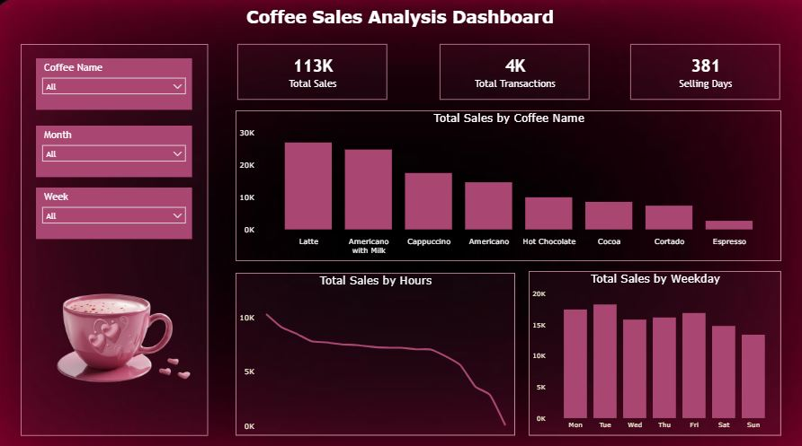

# ☕ Coffee Sales Analysis Dashboard

## 📊 Project Overview

This project is an interactive Coffee Sales Analysis Dashboard developed using Microsoft Power BI.

The dashboard analyzes coffee shop sales data to understand sales performance across different coffee products, hours, and weekdays. It provides a visual overview of key business metrics and helps identify sales patterns and top-performing coffee products.

## 🛠️ Tools & Technologies

- Microsoft Power BI
- DAX
- Data Analysis
- Data Visualization

## 📌 Key Performance Indicators

- Total Sales: 113K
- Total Transactions: 4K
- Selling Days: 381

## 📈 Dashboard Features

- Total Sales by Coffee Product
- Total Sales by Hour
- Total Sales by Weekday
- Top Coffee Products by Sales
- Interactive Coffee Name filter
- Interactive Month filter
- Interactive Week filter
- KPI cards for quick performance analysis

## 💡 Key Insights

- Latte generated the highest total sales among the coffee products.
- Americano with Milk was the second-highest-selling coffee based on total sales.
- Tuesday recorded the highest sales among the weekdays.
- Sales performance varies across different hours of the day.
- The dashboard allows users to filter the analysis by coffee name, month, and week.

## 🎯 Project Objective

The objective of this project is to transform coffee shop sales data into an interactive Power BI dashboard that provides clear and meaningful business insights through data visualization.

## 📷 Dashboard Preview

## 📂 Project Files

- `Coffee_Sales_Dashboard.pbix` – Power BI dashboard file
- `Coffee_Sales_Dashboard.png` – Dashboard preview
- `README.md` – Project documentation
